[CloudNet@](https://gasidaseo.notion.site/CloudNet-Blog-c9dfa44a27ff431dafdd2edacc8a1863)에서 진행하고 있는 CI/CD Study 8주차에는 [Vault](https://www.vaultproject.io/)의 HA(High Availability) 및 TLS 설정에 대해 다루었습니다.  

구성 방법의 이론적 부분은 단순했으나, 예상한 구성 방법과 달라서 제가 나중에 참고하려고 부연설명을 해두려고 합니다. 

## 0. 실습 환경 준비

> 해당 구성들은 아래 GitHub에 탑재되어 있습니다.  
> <https://github.com/kkumtree/ci-cd-cloudnet-study> 의 8w 폴더
> Helm v4 출시 후 한 달도 안된 시점에 작성되었기에, v3에 호환되는 차트 버전을 명시하여 배포했습니다.  

kind 배포와 ingress-nginx, 그리고 vault-worker 까지 배포하면, 아래와 같은 구성도가 됩니다. 

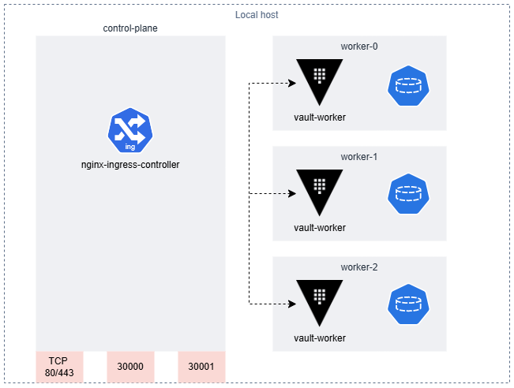

(1-1) kind의 경우 (8w/shells/kind/up-kind.sh)  

1. control-plane 하나 (containerPort:hostPort)  
   - 80:80, 443:443 (TCP)  
   - 30000:30000, 30001  
2. vault-worker간 raft 알고리즘을 위한, 3개의 worker 노드

(1-2) ingress-nginx의 경우 (8w/shells/kind/up-kind.sh)  

- kind용으로 배포하며 해당 컨트롤러가 control-plane에 배포됩니다.  
- nodeSelecter: `ingress-ready:true`
- SSL paththrough 활성화
  (배포 단순 확인을 위해, `traefik/whoami` 서비스 추가 배포)  

(2) vault-worker의 경우 (8w/shells/vault/vault-ha.sh)  

1. HA모드 활성화 및 replica 3개 구성
   - raft 및 ui 활성화 / TLS 비활성화
   - Port: 8200(API), 8201(vault-worker간 통신)
   - kubernetes 서비스 등록
2. readinessProbe 활성화
3. PVC: raft 데이터 저장 (10Gi)  
4. UI (NodePort)  
   - externalPort: 8200
   - serviceNodePort: 300000
5. injector 비활성화  

## 1. Vault 클러스터 구성

각 worker 노드에 배포된 replica pod들에서 로그를 반복적으로 확인할 수 있습니다.  
또한 구성이 완료되지 않은 상태이기 때문에, running 상태가 아님을 확인할 수 도 있습니다. (readinessProbe)  

```log  
[INFO]  core: security barrier not initialized  
[INFO]  core: seal configuration missing, not initialize  
```  

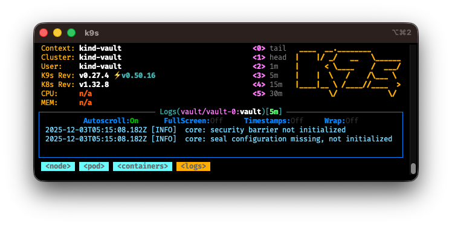

그래서 아래와 같은 절차를 밟습니다.  

1. 3개의 Pod 중 하나를 선택하여, 터미널에서 Vault 클러스터 초기화(initialize)를 합니다.  
   - 출력되는 Unseal Key 5개와 Initial Root Token 1개를 메모해둡니다.  
   - Unseal Key 3개를 골라, Vault를 Unseal 상태로 바꿉니다. (다수결 충족 및 리더로 선출)  
   - 해당 Pod에서 확인되는 Vault HA Cluster 주소를 메모해둡니다.  
2. 남은 Pod의 터미널에서는 **초기화하지 않습니다**.  
   - 초기화한 Vault Pod에서 확인된 Cluster 주소를 기반으로 Cluster에 Join 합니다.  
   - Vault를 Unseal 상태로 만듭니다. (1번에서 고른 3개의 **Unseal Key** 사용)  

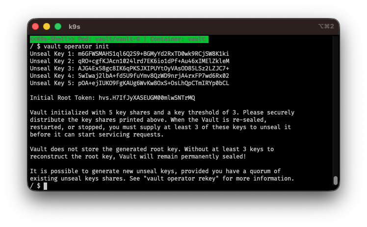  

이를 도식화하면 아래와 같이 됩니다.  

(1-하나의 Pod를 초기화)  
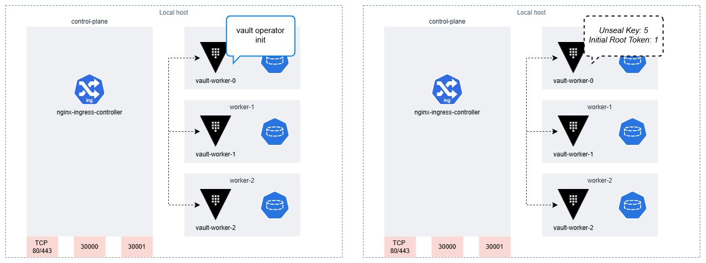  

(2-해당 Pod에서 Unseal 시행)  
  

(3-남은 Pod에서 초기화한 Pod로 Join)  
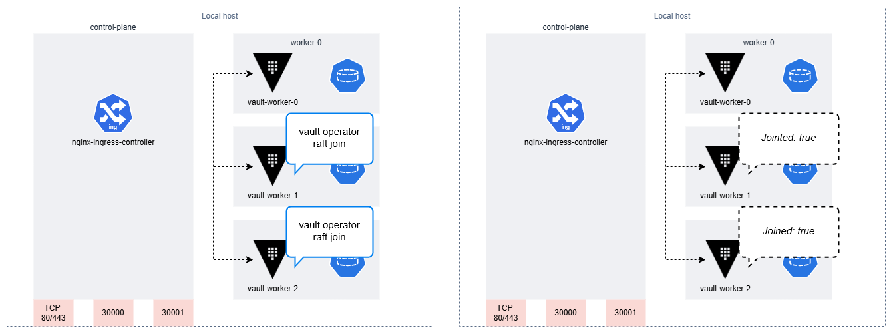  

(4-남은 Pod에서 Unseal 시행)  
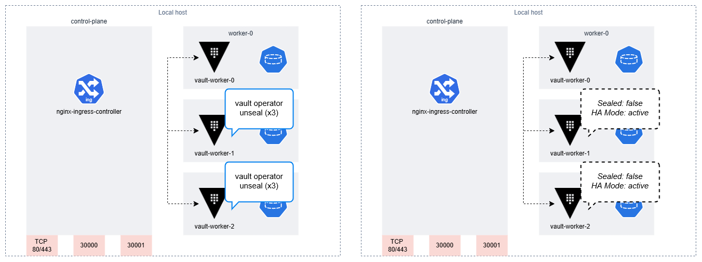  

각 Pod에서 Unsealed 시행 시 다음과 같이 확인할 수 있습니다.  

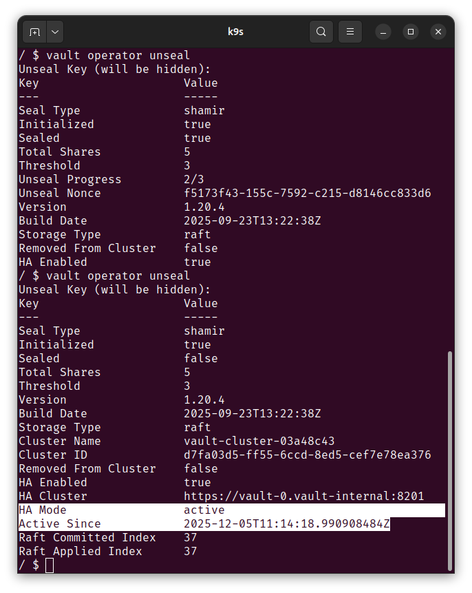  

vault-0 Pod가 Unsealed 되었을 시, 아래와 같이 해당 Pod만 Ready 상태가 됩니다.  

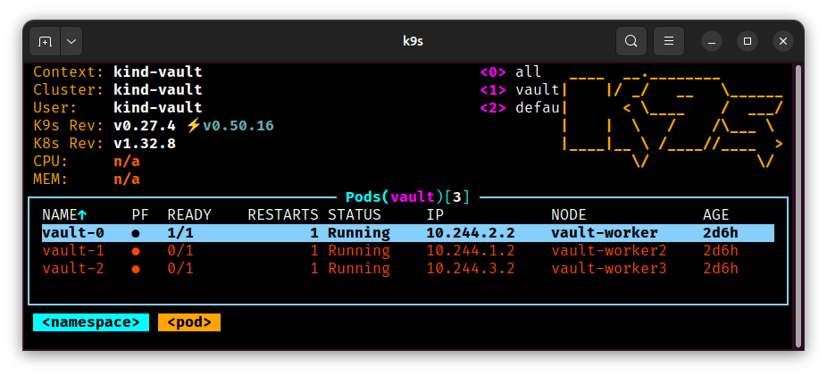

다른 두 Pod에서 join 후, 똑같이 Unsealed를 하면 이 또한 Ready 상태가 됩니다.  

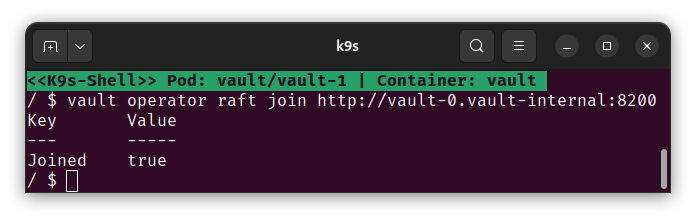

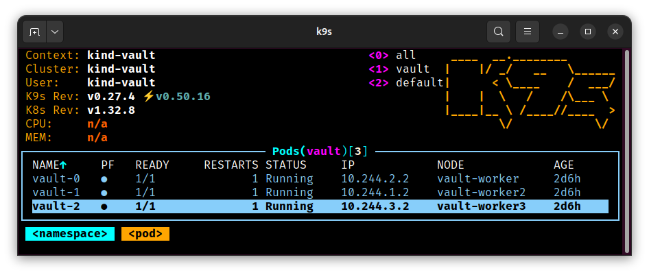

이후 vault-worker Pod 외부에서 vault와 통신하려면, 아래와 같이 두 변수를 설정해야합니다.  

- `VAULT_ROOT_TOKEN`: 초기화 시 확인된 root token  
- `VAULT_ADDR`: 'http://localhost:30000' (ui.ServiceNodePort)

> 여기서 눈치챘겠지만, vault cli는 HTTP API 호출을 기반으로 한다는 것을 알 수 있습니다.  

그러면 아래와 같이 leader 1개, follower 2개의 raft 피어목록을 확인할 수 있습니다.  

```bash  
# vault login
vault operator raft list-peers  
```  

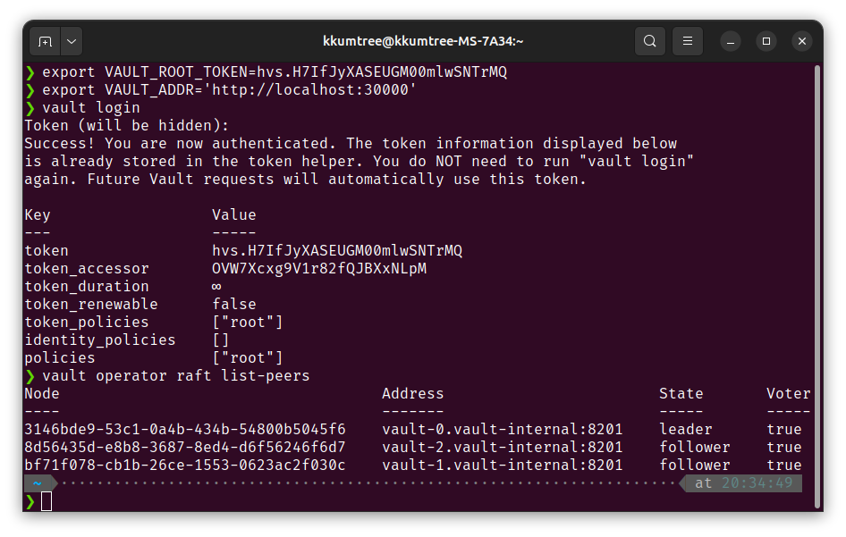  

## 2. Vault API 간단 맛보기  

