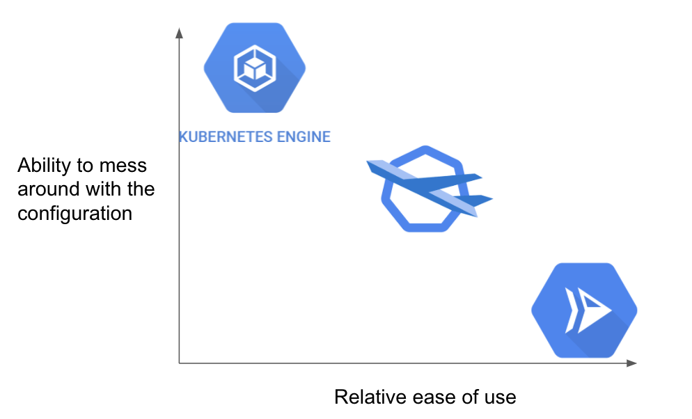

Jpub에서 최근 출판한 [그림으로 배우는 구글 클라우드 101 - 제이펍 홈페이지](https://jpub.tistory.com/1488)에 대해,  
짧막하게 소개하는 글입니다.  

```info
《그림으로 배우는 구글 클라우드 101》 서평단으로 본 도서를 제공받아 작성하였습니다.
```

최근 AWS 프로젝트를 진행하고 있습니다. Terraform을 활용하여, IaC 기반의 인프라 구성을 하고 있는데요.  

작년부터 DR(DR, Disaster Recovery)이 급격하게 화두가 되면서,  
Multi-AZ, Multi-Region을 넘어 Multi-Cloud도 고려의 대상이 되는 것 같습니다.  

관심이 있는지라 이번 프로젝트가 끝나면, AWS 외에도 GCP같은 다양한 CSP를 다시금 다뤄보고 싶다는 생각이 들었습니다.  

물론 GCP를 주력으로 쓰고 있다면 이야기가 다르겠지만,  
맨 처음 클라우드를 배우는 입장, 혹은 GCP에 대한 구축 경험이 적은 상황에서 요구사항에 따라 추가적으로 GCP를 구축해야하는 상황이라면  
국내에서는 기존에 GCP를 빠르게 접근하고 배울 수 있는 방법이 AWS 대비 많지 않다고 느꼈습니다.  

예를 들어, 아래의 두 가지 방법이 대표적인데요.  

- GCP Webinar에 꾸준히 참여하여, GCP의 기본적인 서비스들에 대해 알아가는 방법
- Cloud Skill Boost(구, Qwiklabs) 같은 공인 온라인 핸드온을 따라해보는 방법

Cloud Skill Boost를 통해, 초반에 Cloud에 대해 친숙해지는 데에는 제가 분명 큰 도움이 되었지만,  
**쉽사리 머릿 속에 그림으로 그려지지 않아 답답했습니다.**
아, Cloud Skill Boost를 학습하면 뱃지를 줍니다. 뱃지를 모아보세요. :) [(뱃지 컬렉션 현황)](https://www.cloudskillsboost.google/public_profiles/0e8961a9-5e24-4077-b436-eb0933ee96a6)  


특히 주변 몇몇과 함께 (당시)Qwiklabs를 진행하면서,  
GCP 웹 콘솔의 인터페이스는 어디에 뭐가 있는지 명확하지 않다는 의견이 있었고요.  
처음에 Cloud shell에서 authority 활성화를 해야, 작업이 수월해진다는 것도 웨비나를 통해 알게 되었습니다.  

웨비나나 오프라인 세미나에 참여하여 들어봐도, 돌아와서 다시 정리해보면 아래처럼 그림이 한번에 그려지는 것도 아니었고요.  


( 출처: <https://devopsnet.com/2022/01/04/cloud-run-vs-gke-vs-gke-autopilot/> )

물론 지금은 Terraform 덕에 인터페이스의 까칠한 정도는 크게 상관이 없지만, 아무래도 진입 장벽이 되는 것은 사실입니다.  

특히나, 팀프로젝트를 진행해보면서 많은 분들께서 국내 블로그들을 많이 참조한다는 것을 깨닫게 되었는데,  
AWS 대비 GCP로 인프라 아키텍처를 구성하는 사례들이 적기에 초반에 배우기가 힘든 것 같습니다.

그렇게 오랫동안 GCP를 내려놓고 있다가, 서평단 공고를 보고 호기심이 동하여 응모하여 책을 받아보았습니다.  
일반 전문서적과는 다르게 가로로 길게 되어있는 책입니다.  


책의 저작권이 있기에 온라인 서점에서 제공된 미리보기 페이지 기준으로 소개하려고 합니다.  

대표적으로 서버리스 서비스는 AWS에서 Lambda, GCP에서는 Cloud Function이라는 이름으로 제공되고 있습니다.  

책의 왼쪽에는 GCP의 Cloud Function에 대해 중요 포인트에 대해 요약된 그림이 그려져있습니다.  


오른쪽에는 해당 서비스에 대해 어떤 특징을 갖고 어떻게 쓰는 것인지 설명이 되어있습니다.  


현재 프로젝트가 한창이라, 이것이 끝나게 되면 책의 남은 부분들을 읽어보며  
GKE Autopilot 모드(AWS EKS Fargate와 비슷한 서비스)와 같은 GCP 서비스들을 이해하고  
기존에 체득하고 인지하고 있는 AWS 서비스들과 머릿속에서 매핑해보려 합니다.  

단점은 일반 전문서적처럼 인덱싱이나 목차가 상세하지 않다는 점이지만,  
어차피 각 섹션별로 나와있는 내용은 GCP를 사용함에 있어 다 알고 있어야하는 내용이기에 크게 결점으로 느껴지진 않았습니다.


다시 한번 도서 서평단으로 선정해주신 제이펍에 감사드립니다.

- 구매처 모음: [네이버 쇼핑](https://search.shopping.naver.com/book/catalog/43663962633)  
