한가위 연휴의 끝과 함께, [CloudNet@](https://gasidaseo.notion.site/CloudNet-Blog-c9dfa44a27ff431dafdd2edacc8a1863)에서 진행하고 있는 CI/CD Study에 참여하게 되었습니다. 

이번에는 핸즈온용으로 즐겨쓰는 GitHub CodeSpace와 연관된, 
Visual Studio 상에서의 Dev Containers 활용에 대해 다뤄보고자 합니다. 

> 사용 OS환경은 Ubuntu Desktop 24.04 LTS 이며, 
  아래의 문서에서 안내된대로 차근차근 따라해보며 좀 더 이해를 해보고자 합니다. 

[Developing inside a Container](https://code.visualstudio.com/docs/devcontainers/containers)  

## 0. Docker 설치

내용이 길어, 아래의 포스트로 나누었습니다.  

- [Ubuntu Docker 설치](https://blog.minseong.xyz/post/docker-installation-in-ubuntu/)  
- 작성 기준, Dev Container는 Ubuntu Snap 패키지(snapcraft)로 설치된 Docker에는 지원되지 않는다고 합니다. 
- 사용자(`$USER`)를 `docker` 그룹에 추가하여야합니다.  
  (위 게시물의 `3. 권한 상승 설정 (선택)` 참고)

## 1. Dev Containers 확장 프로그램  

Visual Studio Code(이하, VSCode)에서 제공되는, `Dev Containers` 확장 프로그램을 사용하면, 개발 환경에 필요한 모든 기능이 갖춰진 Container를 구축하여 환경을 구성할 수 있습니다. 

컨테이너 내부 혹은 컨테이너에 마운트된 폴더를 통해 접근하여, VSCode IDE의 모든 기능을 사용할 수 있습니다. 

핵심은 `devcontainer.json` 파일이며, 프로젝트 단위에서 개발용 컨테이너의 구성 및 접근 방법이 명세되어 있습니다. 
이를 통해, 앱을 구동하거나 코드 개발에 필요한 도구, 라이브러리, 혹은 런타임을 사전에 정의할 수 있습니다.  

1. 컨테이너 내에서 구동될 파일들: 로컬 환경의 파일이 마운트되거나, 컨테이너 내부로 복사됩니다.  
2. VSCode의 확장 프로그램들: 컨테이너 내부에 설치되며, 내부의 플랫폼 및 파일시스템에 대한 **모든 권한**을 가집니다.  

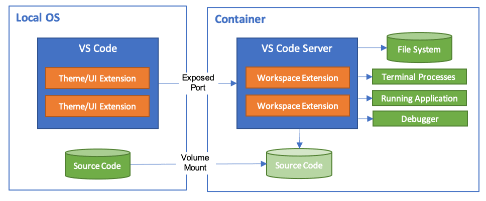

이를 통해,  

- 개발환경을 쉽게 전환할 수 있습니다.  
- 다양한 로컬 환경과 관계없이, 개발 환경을 일관성있게 유지할 수 있습니다.  

`Dev Containers` 확장 프로그램은 두 가지 기본 모델을 지원합니다.  

1. 컨테이너를 풀타임 개발환경으로 사용하거나,  
2. 실행 중인 컨테이너에 연결하여 사용할 수 있습니다. 

## 2. 시작 전 설정

- 로컬 환경: 
  1. Docker 및 VSCode가 설치되어야 합니다.  
    (VSCode와 같은 경우, 기존 [게시물](https://blog.minseong.xyz/post/how-to-manage-microsoft-packages-with-apt-manager/)이 도움 될 수 있습니다.)
  2. Dev Container 확장프로그램을 설치합니다. 
- Git을 사용한다면: 이를 위한 로컬의 SSH Key를 공유하도록 설정할 수 있습니다.  

### Dev Container 확장프로그램 설치

VSCode 내 Extenstion 메뉴를 열고 Dev Contatiners를 검색, 설치 합니다.  
(Microsoft를 확인합니다)

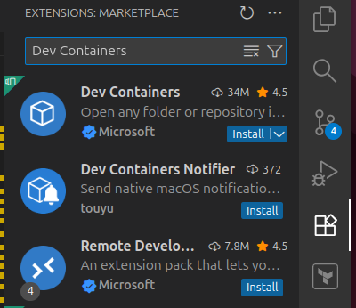

  

### Git 사용을 위한, Host SSH 키 사용 설정  

> 아래 문서의 내용에 따라, Dev Containers에서 Host의 SSH 키를 사용할 수 있도록 `ssh-agent`를 설정합니다.  
> SSH키에 암호가 있을 경우, git 동기화에 이슈가 발생할 수 있습니다. 이는, `git push` 명령어를 통해 우회하거나, 암호가 없는 SSH키를 사용하여야합니다.  

[Sharing Git credentials with your container](https://code.visualstudio.com/remote/advancedcontainers/sharing-git-credentials)  

#### (1) `.gitconfig` 파일에 대해서  

Dev Containers 확장 프로그램은 Host의 `.gitconfig`파일을 컨테이너에 자동으로 복사합니다.  

이 파일은 아래처럼 git config --global 을 통해 지정한 전역 설정값을 담고 있습니다.  

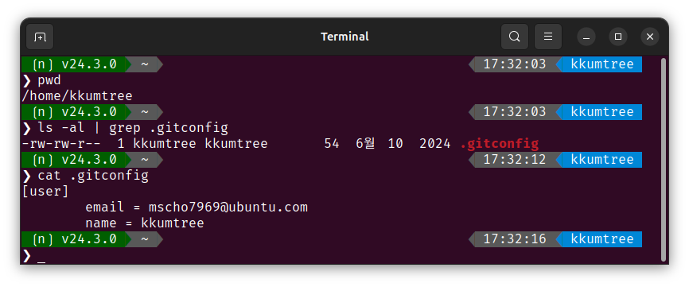

#### (2) ssh-agent 실행 설정  

MacOS와는 달리, Linux환경에서는 자동으로 실행하도록 섧정되어 있지 않으므로 오류를 방지하기 위해 설정합니다.  

- SSH Agent가 백그라운드에서 구동되도록 설정합니다.  

```bash
eval "$(ssh-agent -s)"
```

- Shell 프로파일에 아래의 내용을 추가하여, 자동 실행될 수 있도록합니다. (위의 명령어가 실행된 상태여야 합니다.)  
  - (bash) `~/.bash_profile` / (zsh) `~/.profile`  
  - 사용자 지정 기본 쉘 확인: `echo $SHELL`  
  - 현재 사용 중인 쉘 확인: `echo $0`  
    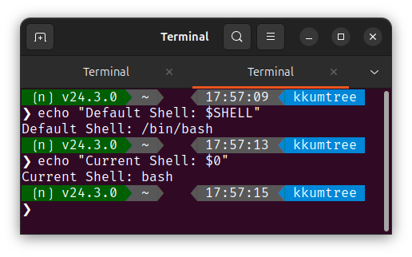

```bash
# 적용 전, SSH AUTH소켓이 지정되었는 지 확인합니다. 
echo "$SSH_AUTH_SOCK"
``` 

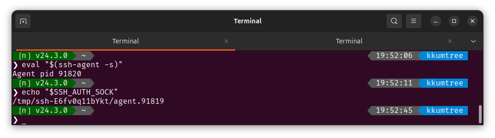


```bash  
# TTMP=$(basename "$0"); if [ "$TTMP" = "bash" ]; then ls -l ~/.bash_profile ; elif [ "$TTMP" = "zsh" ]; then ls -l ~/.zprofile; else echo "현재 쉘: $TTMP은 bash 혹은 zsh이 아닙니다."; fi;unset TTMP
if [ -z "$SSH_AUTH_SOCK" ]; then
  # Check for a currently running instance of the agent
  RUNNING_AGENT="`ps -ax | grep 'ssh-agent -s' | grep -v grep | wc -l | tr -d '[:space:]'`"
  if [ "$RUNNING_AGENT" = "0" ]; then
    # Launch a new instance of the agent
    ssh-agent -s &> $HOME/.ssh/ssh-agent
  fi
  eval `cat $HOME/.ssh/ssh-agent` > /dev/null
  ssh-add 2> /dev/null
fi
```

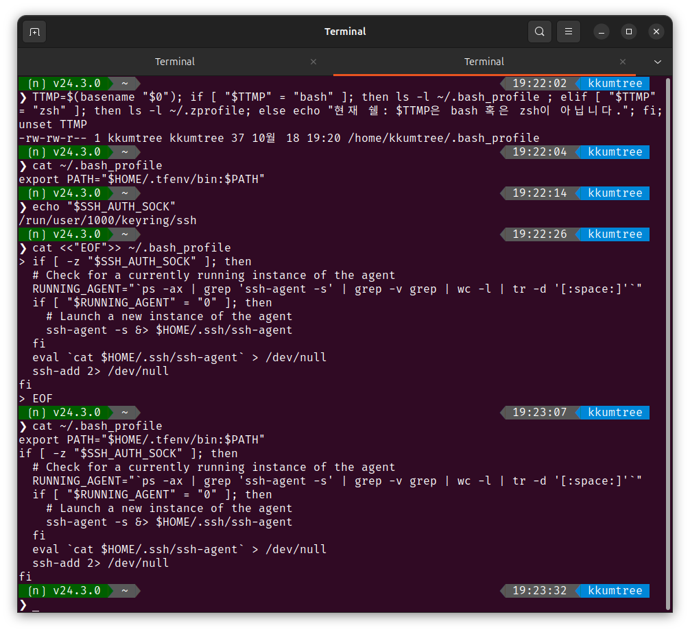

- 이후, 마지막 줄을 설정할 지정한 SSH key로 바꿉니다.  

```bash
# $HOME/.ssh/id_ed25519 키를 사용할 경우 

# # 확인
# sed 's#ssh-add 2> /dev/null#ssh-add $HOME/.ssh/id_ed25519 2> /dev/null#' ~/.bash_profile | tail -n 4
# 적용
sed -i 's#ssh-add 2> /dev/null#ssh-add $HOME/.ssh/id_ed25519 2> /dev/null#' ~/.bash_profile
# 적용 확인
tail -n 4 ~/.bash_profile  
# ps -ax | grep 'ssh-agent -s' | grep -v grep | wc -l | tr -d '[:space:]'
```

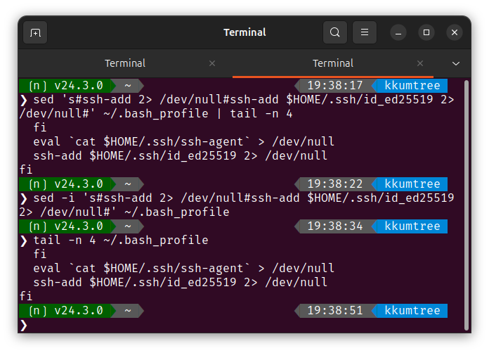

## 3. Quick Start

3가지로 구성되어 있습니다.  

1. 개발용 컨테이너 사용해보기  
2. 컨테이너에서 기존 폴더 열어보기  
3. 격리된 컨테이너 볼륨에서 Git 저장소 또는 GitHub PR 열어보기  

### (1) 개발용 컨테이너 사용해보기  

가장 쉬운 방법으로, 개발용 컨테이너 샘플 중 하나를 사용해봅니다.  

- `docker --version` 명령어로 docker 설치여부 확인  
  상단 검색바를 선택 후, `>Try a Dev` 를 입력하여 `Dev Containers: Try a Dev Container Sample...`을 선택합니다.  
  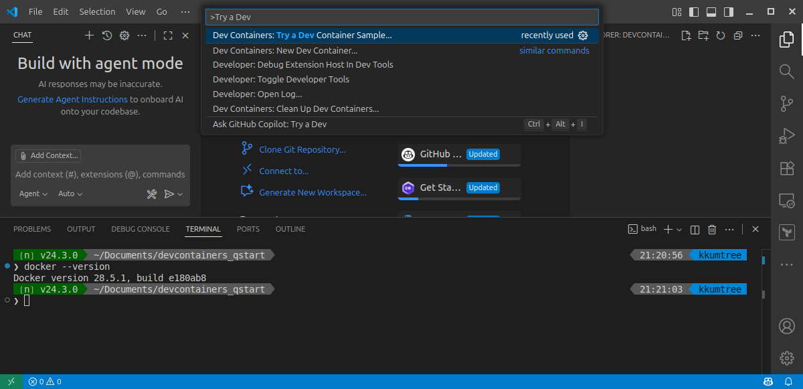
- `Node`를 선택합니다.  
  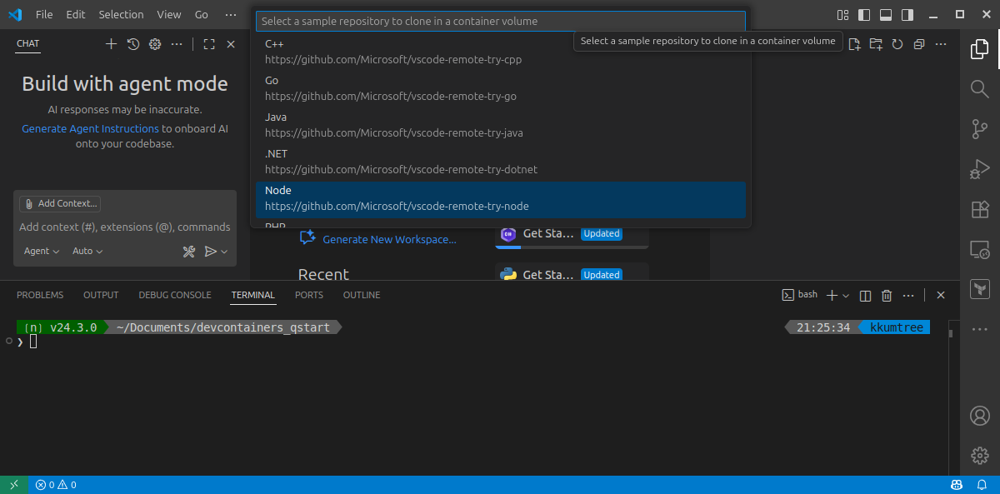
- 선택하면 아래와 같이 표시되며, 빌드가 완료될 때까지 대기 합니다.  
  - 우측 하단: `Connecting Dev Container (show log)`  
  - 좌측 하단: `Dev Container: <컨테이너명>`  
  - 우측 하단의 메시지를 클릭하면 아래처럼 Docker 작업 현황을 볼 수 있습니다.  
    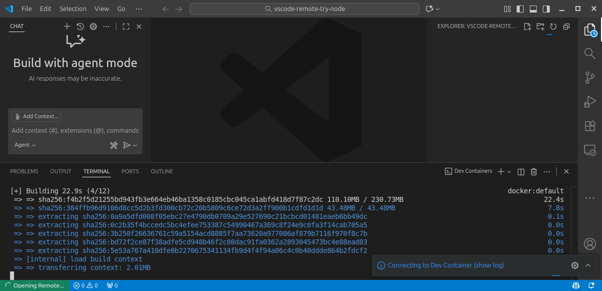
- `TERMINAL` 탭에서 `+`를 클릭하여 `New Terminal` 또는 `New Terminal Window`를 선택합니다.  
  이번에는 `New Terminal Window`를 선택하여, 새 창에 터미널을 띄워보겠습니다.  
  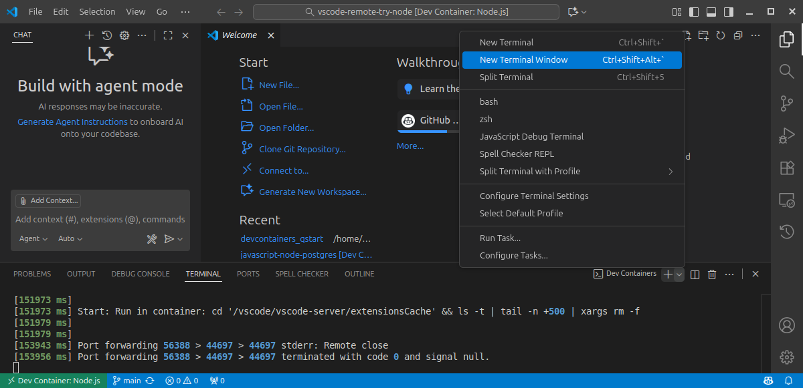
- Node 버전을 확인해보겠습니다.

  ```bash
  # node --version; npn --version
  node -v; npm -v 
  ```

  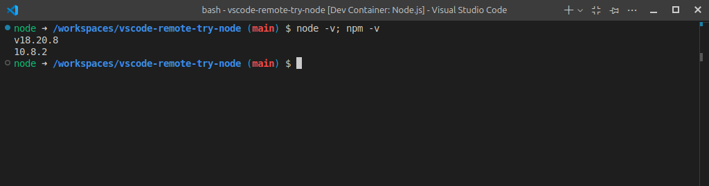  
- VSCode에서 `F5`키를 눌러 애플리케이션을 실행해보겠습니다.  
  - `DEBUG CONSOLE` 탭: 3000포트에서 샘플 어플리케이션이 구동되고 있음
  - `PORT` 탭: Forwarded port, 로컬 포트 3000번이 열림  
    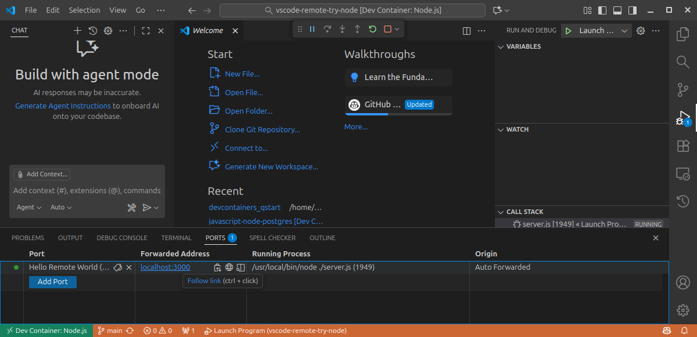  
- 브라우저에서 `http://localhost:3000`으로 이동하면, 간단환 Node.js 서버가 실행되고 있음을 확인할 수 있습니다.  
  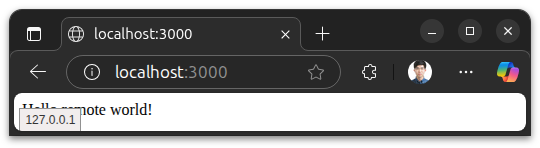  
- `File > Close Remote Connection`을 클릭하여, 원격 세션을 종료합니다.  
  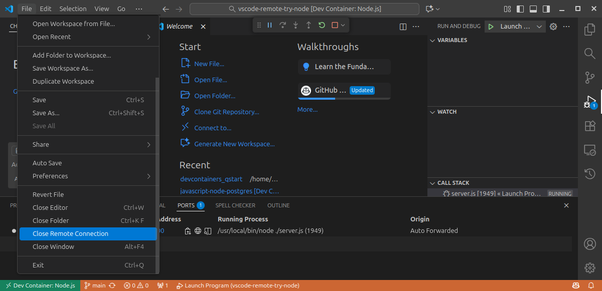

#### Dev Containers 확장 프로그램의 작동 원리

- 확장 프로그램은 `.devcontainer` 폴더에서 아래의 파일을 기반으로 Dev Container를 생성합니다.  
  - `devcontainer.json`  
  - (옵션) `Dockerfile`, `docker-compose.yml`  
- `devcontainer.json`  
  > GitHub: [microsot/vscode-remote-try-node](https://github.com/microsoft/vscode-remote-try-node/blob/main/.devcontainer/devcontainer.json)  
  1. "image"에 정의된 이미지를 사용하여, 이미지를 빌드합니다.  
  2. "customizations"에 정의된 `streetsidesoftware.code-spell-checker` 확장 프로그램을 설치합니다.  
  3. "portsAttributes"에 지정된 `3000` 포트를 노출합니다.  
  4. "portsAttributes"에 지정된 `yarn install`로 yarn 패키지를 설치합니다.  

### (2) 컨테이너에서 기존 폴더 열어보기

그러면 Host의 기존 소스 코드를 사용해서, 기존 소스 코드의 언어를 위한 Dev Container를 설정해보겠습니다.  

> 기존의 Go 언어 소스코드가 있기에, Go언어에 대해 완비된 개발 환경을 설정해보겠습니다.  

- `F1`로 명령 팔레트를 호출하여(상위 검색 바를 클릭 후, `>`를 입력하는 것과 같은 효과), `Dev Containers: Open Folder in Container...` 를 실행합니다.  
  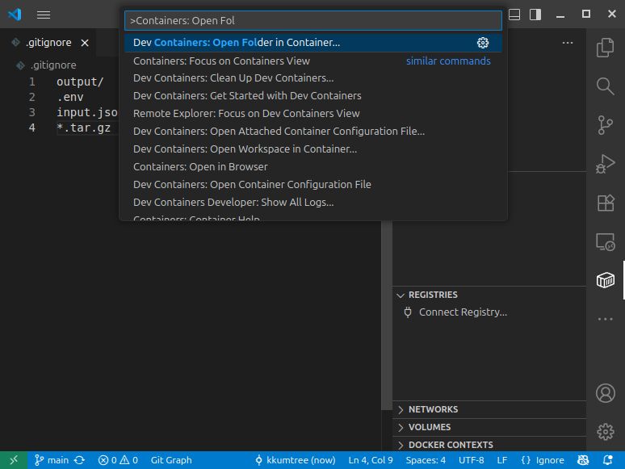
- 이후, 대상 프로젝트 폴더를 선택한 후, `Open`을 클릭합니다.  
  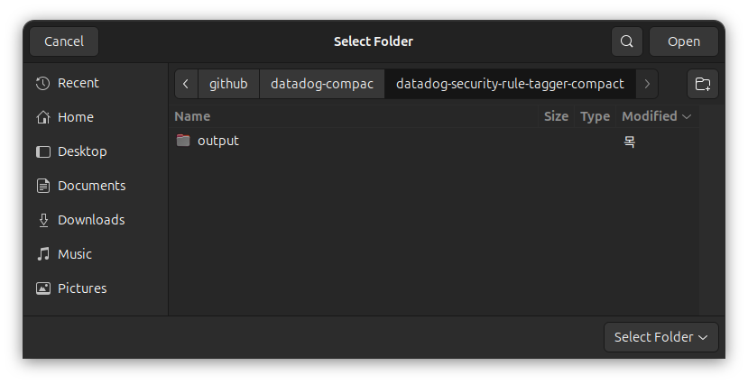 
- 이번에는 `Add configuration to user data folder`를 선택하여, 로컬에 설정을 저장합니다.
  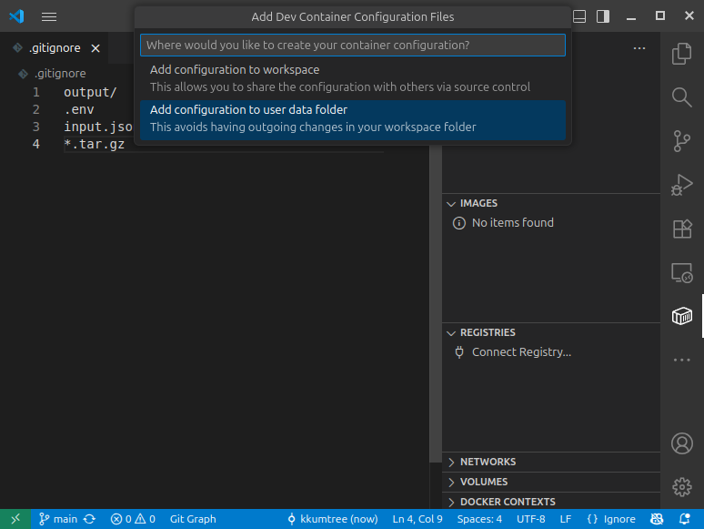
  - 로컬 설정값의 경로: `$HOME/.config/Code/User/globalStorage/ms-vscode-remote.remote-containers/configs`  
    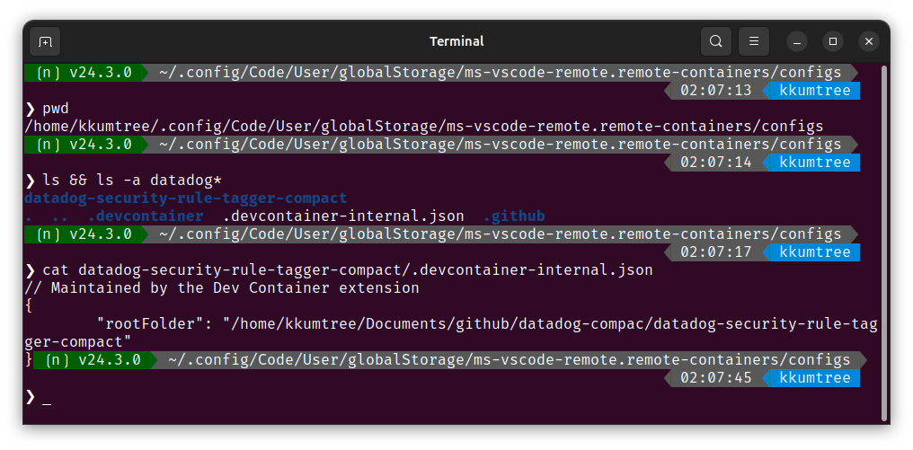
- 이후, 추천받은 Go 컨테이너를 선택해봅니다.  
  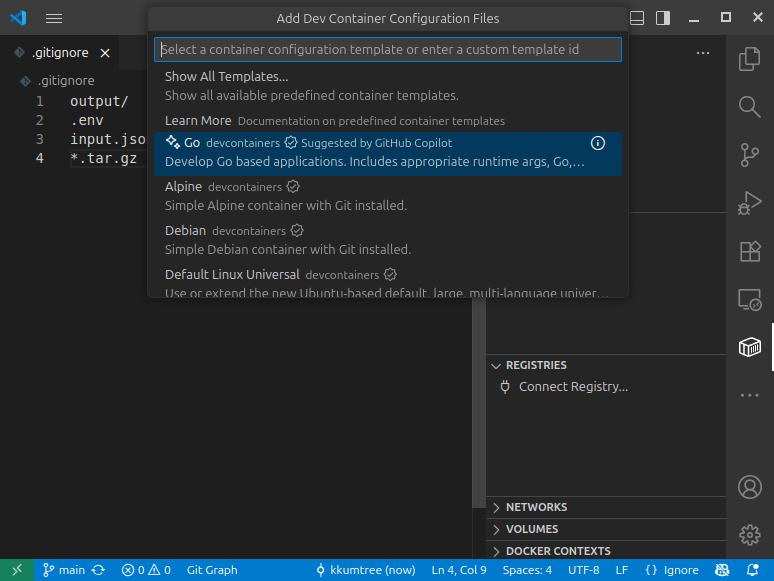
- 기존 소스코드가 go1.22 버전 기반이었기에, `1.22-bookworm`을 선택해봅니다.  
  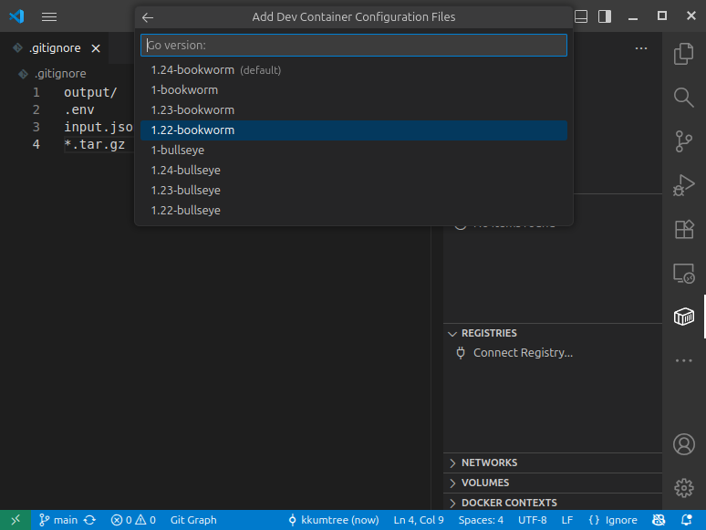
- (선택) 그외에 다양한 부가 기능을 선택하여 미리 추가할 수 있습니다. 이번에는 생략합니다.  
  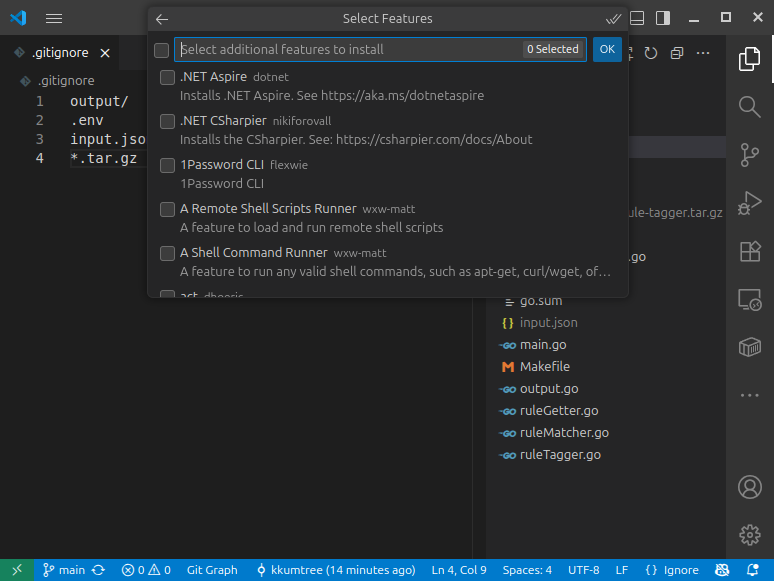
- (선택) dependabot.yml 생성. 무해하기에 선택해서 생성해보았습니다.  
  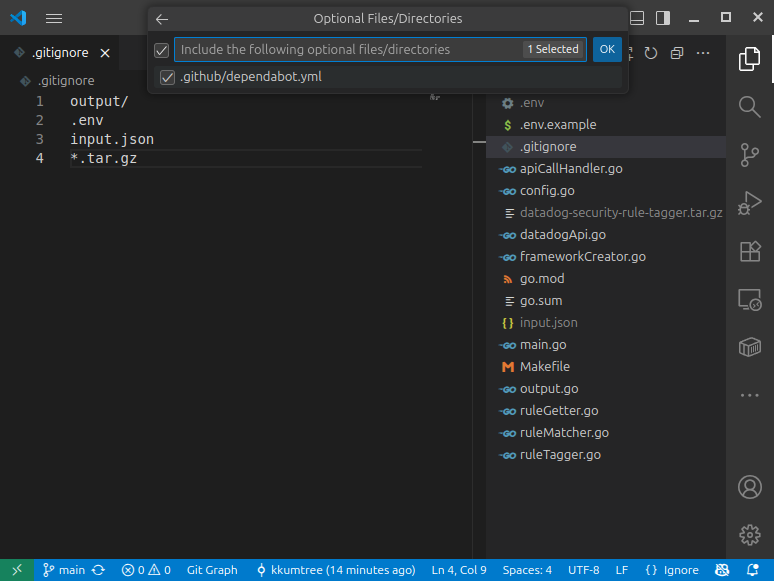

- 그러면 Dev Container 구성을 시작합니다.  
  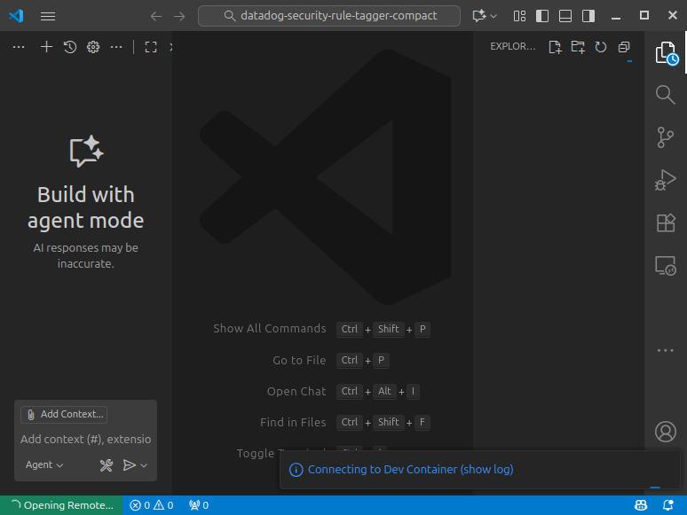

- Go 1.22가 미리 구성된 Dev Container 환경 내에서 VSCode로 코드를 편집, 테스트할 수 있습니다.  
  또한, 컨테이너 환경에서 소스코드 수정을 하면, Host에서도 변경된 소스코드를 확인할 수 있습니다.  
  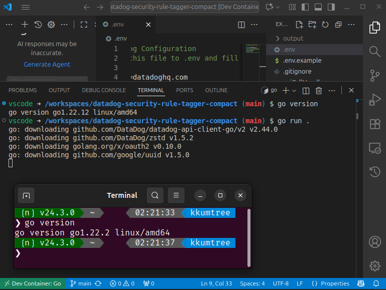  

### (3) 격리된 컨테이너 볼륨에서 Git 레포지토 또는 GitHub PR 열기  

PR 검토를 위한, Git 레포지토리 격리된 복사본을 사용하거나 작업에 영향을 주지 않고 다른 브랜치를 조사하려는 경우

<!-- > 아래는 현재와 달라서 주석 처리

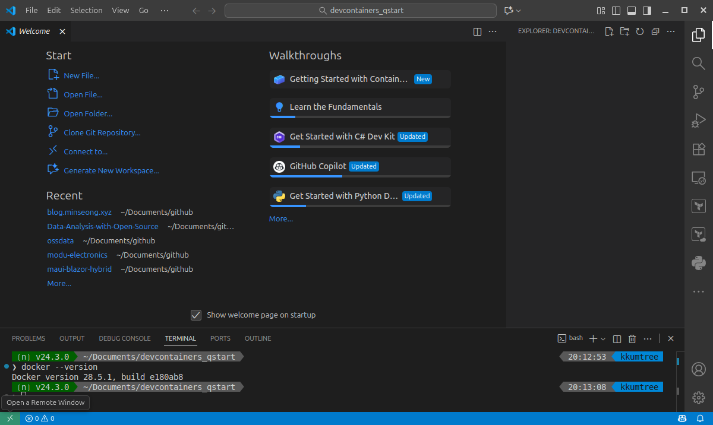

- VSCode 좌측 하단에 `><` 아이콘(Open a Remote Window)을 클릭합니다.  

- `New Dev Container...`를 클릭합니다.  
- 이후, Node 샘플을 선택하고, `Create Dev Container`를 선택해보겠습니다.  
  
> `devcontainer` 소유의 `Node.js & PostgreSQL`을 선택해보았으며,  
> 실제는 작성 시점과 다를 수 있습니다.  

- 우측 하단의 제안에 `Container Tools` 확장 프로그램 설치 안내가 있어, 컨테이너 내에 대하여 해당 확장을 설치해보겠습니다.  
  - 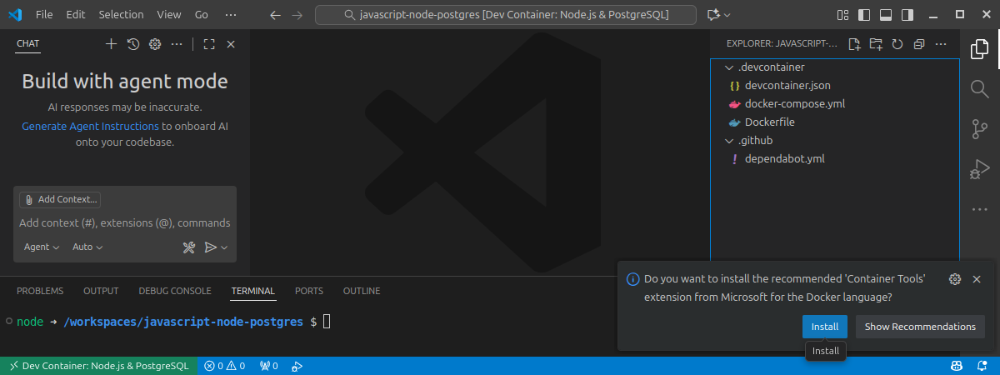

  - `Node.js`를 선택해보겠습니다.  

<https://github.com/devcontainers/templates/tree/main/src/javascript-node-postgres> -->